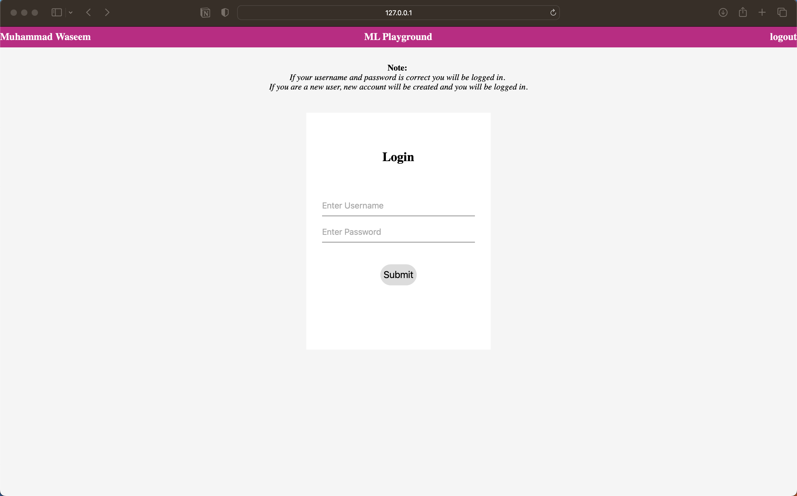
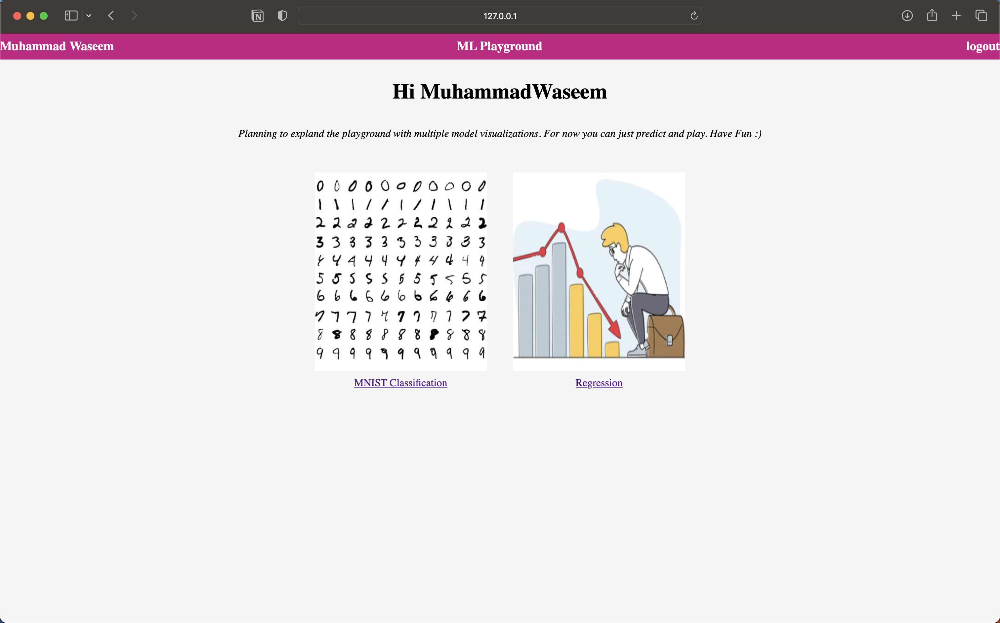
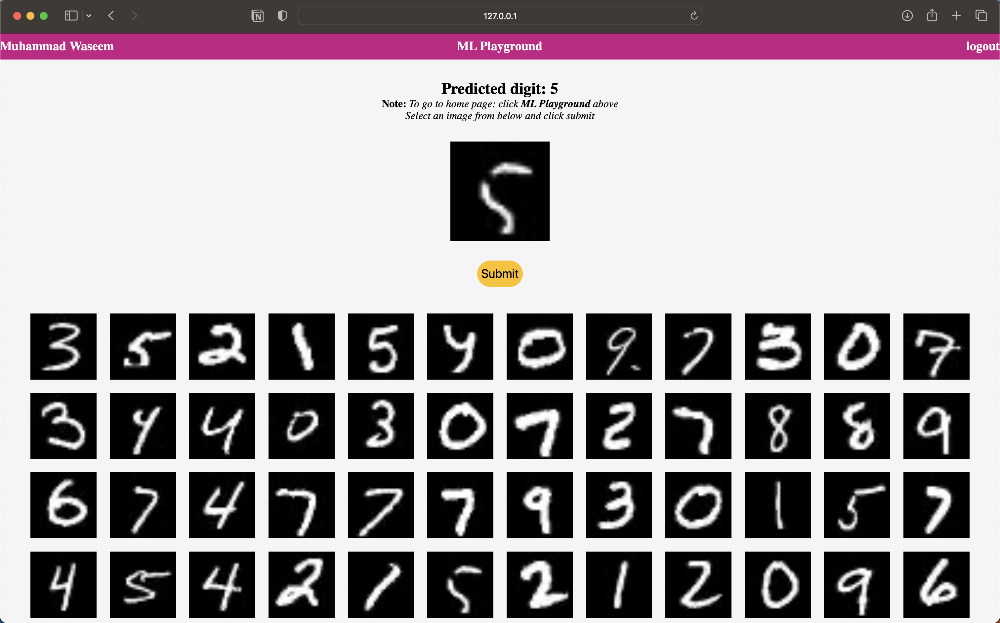
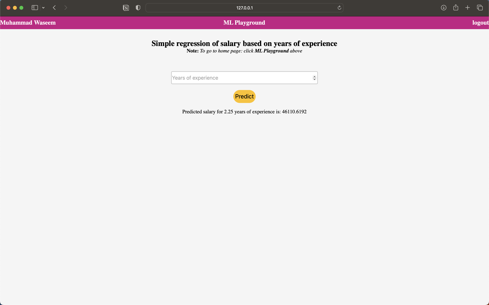

# ML Playground
Started as an assignment in college, but now planning to expand it as a kind of ML playground.

Currently just does basic classification and regression

## Requirements
```
torch
flask
Pillow
numpy
```

Other dependencies are by default available in python.

## Usage
Clone to repo
```bash
git clone https://github.com/hwaseem04/UG-Assignments
```

Move to directory
```bash
cd Semester-IV/MLT-CIA-2/Flask
```

Run flask
```bash
flask run
```

## Application
**Demo**
- [Youtube](https://youtu.be/ZxD-EQH4rVA)


**Login Page**


**Home Page**


**Mnist Page**


**Simple regression Page**


## Contribution
- If you have interest in further contributing to this with your own model/visualisaion, make a Pull request.
